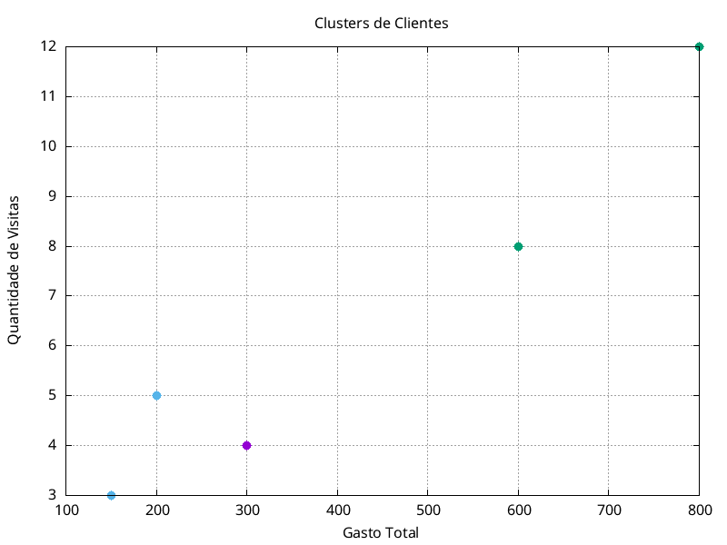

# Projeto de Agrupamento de Clientes com K-Means

## Instruções para executação

### Compilar o Programa

Para compilar o programa, utilize o seguinte comando no terminal:

```sh
gcc main.c -o kmeans -lm
```

### Executar o Programa

Para executar o programa, utilize o comando:

```sh
./kmeans
```

### Gerar o Gráfico

Após executar o programa, será gerado um arquivo `clusters.dat` contendo os dados dos clusters. Para gerar o gráfico, use o `gnuplot` com o script `plot_clusters.gnuplot`:

```sh
gnuplot plot_clusters.gnuplot
```

### Estrutura do Projeto

- `main.c`: Código fonte principal que implementa o algoritmo k-means.
- `clusters.dat`: Arquivo gerado contendo os dados dos clusters após a execução do programa.
- `plot_clusters.gnuplot`: Script do gnuplot para gerar o gráfico dos clusters.

## Resultados

Após a primeira iteração, os clientes foram atribuídos aos seguintes clusters:

- **Cluster 0**:
  - Cliente 1: (300, 4)
  - **Características Comuns**: Clientes com gasto moderado e visitas médias.

- **Cluster 1**:
  - Cliente 2: (600, 8)
  - Cliente 4: (800, 12)
  - **Características Comuns**: Clientes com alto gasto e alta frequência de visitas.

- **Cluster 2**:
  - Cliente 3: (150, 3)
  - Cliente 5: (200, 5)
  - **Características Comuns**: Clientes com baixo gasto e baixa frequência de visitas.

## Gráfico dos Clusters

O gráfico gerado visualiza os clusters formados após a primeira iteração do algoritmo k-means. Cada ponto representa um cliente, e as cores indicam a qual cluster cada cliente pertence.



## Conclusão

O algoritmo k-means foi aplicado com sucesso para agrupar os clientes em três clusters distintos. Esse agrupamento pode ser utilizado pela rede de supermercados para direcionar campanhas de marketing específicas e melhorar a organização de seus produtos.

## Requisitos

- `gcc`: Compilador C
- `gnuplot`: Ferramenta para plotar gráficos
